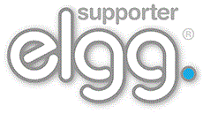

Becoming a Financial Supporter
==============================

All funds raised via the Elgg supporters network go directly into:
 * Elgg core development
 * Infrastructure provision (elgg.org, github, etc.)

It is a great way to help with Elgg development!

Benefits
--------
For only $50 per year for individuals or $150 per year for organizations,
you can get listed as a supporter on `our supporters page`_.
Elgg supporters are listed there unless they request not to be.

.. _our supporters page: http://elgg.org/supporter.php

Supporters are able to put this official logo on their site if they wish:

Disclaimer
----------
We operate a no refund policy on supporter subscriptions.
If you would like to withdraw your support, go to PayPal and cancel your subscription.
You will not be billed the following year.

Being an Elgg Supporter does not give an individual or organization the right to impersonate,
trade as or imply they are connected to the Elgg project.
They can, however, mention that they support the Elgg project.

If you have any questions about this disclaimer, email info@elgg.org.

We reserve the right to remove or refuse a listing without any prior warning at our complete discretion.
There is no refund policy.

If there is no obvious use of Elgg, your site will be linked to with "nofollow" set.

Sign up
-------
If you would like to become an Elgg supporter:

 * read the disclaimer_ above
 * on the supporters page, `subscribe via PayPal`__
 * send an email to info@elgg.org with:
 
   * the date you subscribed
   * your name (and organization name, if applicable)
   * your website
   * your Elgg community profile
 

__ http://elgg.org/supporter.php

Once all the details have been received, we will add you to the appropriate list. Thanks for your support!
