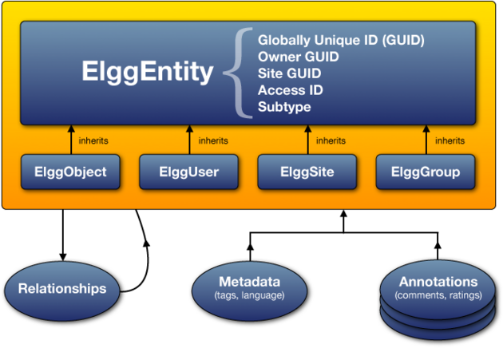

Database
########

A thorough discussion of Elgg's data model design and motivation.

.. contents:: Contents
   :local:
   :depth: 2

Overview
========

In Elgg, everything runs on a unified data model based on atomic
units of data called entities.

Plugins are discouraged from interacting directly with the database,
which creates a more stable system and a better user experience because
content created by different plugins can be mixed together in
consistent ways. With this approach, plugins are faster to develop,
and are at the same time much more powerful.

Every entity in the system inherits the ``ElggEntity`` class. This class
controls access permissions, ownership, containment and provides consistent API
for accessing and updating entity properties.

.. _thumb\|The Elgg data model diagramIn: image:Elgg_data_model.png

You can extend entities with extra information in two ways:

``Metadata``: This information describes the entity, it is usually
   added by the author of the entity when the entity is created or updated.
   Examples of metadata include tags, ISBN number or a third-party ID, location,
   geocoordinates etc. Think of metadata as a simple key-value storage.

``Annotations``: This information extends the entity with properties usually
   added by a third party. Such properties include ratings, likes, and votes.

The main differences between metadata and annotations:

- metadata does not have owners, while annotations do
- metadata is not access controlled, while annotations are
- metadata is preloaded when entity is constructed, while annotations are only loaded on demand

These differences might have implications for performance and your business logic, so consider carefully,
how you would like to attach data to your entities.

In certain cases, it may be benefitial to avoid using metadata and annotations and create new
entities instead and attaching them via ``container_guid`` or a relationship.

Datamodel
=========

   
   The Elgg data model diagram

Entities
========

``ElggEntity`` is the base class for the Elgg data model and supports a common set of properties
and methods.

-  A numeric Globally Unique IDentifier (See `GUIDs`_).
-  Access permissions. (When a plugin requests data, it never gets to
   touch data that the current user doesn't have permission to see.)
-  An arbitrary subtype (more below).
-  An owner.
-  The site that the entity belongs to.
-  A container, used to associate content with a group or a user.

Types
-----

*Actual* entities will be instances of four different subclasses, each having a distinct **type**
property and their own additional properties and methods.

=======  ==============  ===================================================================
Type     PHP class       Represents
=======  ==============  ===================================================================
object   ``ElggObject``  Most user-created content, like blog posts, uploads, and bookmarks.
group    ``ElggGroup``   An organized group of users with its own profile page
user     ``ElggUser``    A user of the system
site     ``ElggSite``    The site served by the Elgg installation
=======  ==============  ===================================================================

Each type has its own extended API. E.g. users can be friends with other users, group can have members,
while objects can be liked and commented on.

Subtypes
--------

Each entity must define a **subtype**, which plugins use to further specialize the entity.
Elgg makes it easy to query specific for entities of a given subtype(s), as well as assign them special behaviors and views.

Subtypes are most commonly given to instances of ``ElggEntity`` to denote the kind of content created.
E.g. the blog plugin creates objects with subtype ``"blog"``.

By default, users, groups and sites have the the subtypes of ``user``, ``group`` and ``site`` respectively.

Plugins can use custom entity classes that extend the base type class. To do so, they need to register their class at
runtime (e.g. in the ``'init','system'`` handler), using ``elgg_set_entity_class()``.
For example, the blog plugin could use ``elgg_set_entity_class('object', 'blog', \ElggBlog::class)``.

Plugins can use ``elgg-plugin.php`` to define entity class via shortcut ``entities`` parameter.

Subtype Gotchas
---------------

- Before an entity's ``save()`` method is called, the subtype must be set by writing a string to the ``subtype`` property.
- *Subtype cannot be changed after saving.*

GUIDs
-----

A GUID is an integer that uniquely identifies every entity in an Elgg
installation (a Globally Unique IDentifier). It's assigned automatically
when the entity is first saved and can never be changed.

Some Elgg API functions work with GUIDs instead of ``ElggEntity`` objects.

ElggObject
==========

The ``ElggObject`` entity type represents arbitrary content within an
Elgg install; things like blog posts, uploaded files, etc.

Beyond the standard ElggEntity properties, ElggObjects also support:

-  ``title`` The title of the object (HTML escaped text)
-  ``description`` A description of the object (HTML)

Most other data about the object is generally stored via metadata.

ElggUser
========

The ``ElggUser`` entity type represents users within an Elgg install.
These will be set to disabled until their accounts have been activated
(unless they were created from within the admin panel).

Beyond the standard ElggEntity properties, ElggUsers also support:

-  ``name`` The user's plain text name. e.g. "Hugh Jackman"
-  ``username`` Their login name. E.g. "hjackman"
-  ``password`` A hashed version of their password
-  ``email`` Their email address
-  ``language`` Their default language code.
-  ``code`` Their session code (moved to a separate table in 1.9).
-  ``last_action`` The UNIX timestamp of the last time they loaded a page
-  ``prev_last_action`` The previous value of ``last_action``
-  ``last_login`` The UNIX timestamp of their last log in
-  ``prev_last_login`` the previous value of ``last_login``

ElggSite
========

The ``ElggSite`` entity type represents your Elgg installation (via your site URL).

Beyond the standard ElggEntity properties, ElggSites also support:

-  ``name`` The site name
-  ``description`` A description of the site
-  ``url`` The address of the site

ElggGroup
=========

The ``ElggGroup`` entity type represents an association of Elgg users.
Users can join, leave, and post content to groups.

Beyond the standard ElggEntity properties, ElggGroups also support:

-  ``name`` The group's name (HTML escaped text)
-  ``description`` A description of the group (HTML)

``ElggGroup`` has addition methods to manage content and membership.

The Groups plugin
-----------------

Not to be confused with the entity type ``ElggGroup``, Elgg comes with
a plugin called "Groups" that provides a default UI/UX for site users
to interact with groups. Each group is given a discussion forum and a
profile page linking users to content within the group.

You can alter the user experience via the traditional means of extending
plugins or completely replace the Groups plugin with your own.

Writing a group-aware plugin
----------------------------

Plugin owners need not worry too much about writing group-aware
functionality, but there are a few key points:

Adding content
~~~~~~~~~~~~~~

By passing along the group as ``container_guid`` via a hidden input field,
you can use a single form and action to add both user and group content.

Use ``ElggEntity->canWriteToContainer()`` to determine whether or not the current user has the right to
add content to a group.

Be aware that you will then need to pass the container GUID
or username to the page responsible for posting and the accompanying
value, so that this can then be stored in your form as a hidden input
field, for easy passing to your actions. Within a "create" action,
you'll need to take in this input field and save it as a property of
your new element (defaulting to the current user's container):

.. code-block:: php

    $user = elgg_get_logged_in_user_entity();
    $container_guid = (int)get_input('container_guid');
    
    if ($container_guid) {
    	$container = get_entity($container_guid);
    	
        if (!$container->canWriteToContainer($user->guid)) {
            // register error and forward
        }
    } else {
        $container_guid = elgg_get_logged_in_user_guid();
    }

    $object = new ElggObject;
    $object->container_guid = $container_guid;

    ...

    $container = get_entity($container_guid);
    forward($container->getURL());

Juggling users and groups
~~~~~~~~~~~~~~~~~~~~~~~~~

In fact, ``[[Engine/DataModel/Entities/ElggGroup|ElggGroup]]`` simulates
most of the methods of
``[[Engine/DataModel/Entities/ElggUser|ElggUser]]``. You can grab the
icon, name etc using the same calls, and if you ask for a group's
friends, you'll get its members. This has been designed specifically for
you to alternate between groups and users in your code easily.

Ownership
=========

Entities have a ``owner_guid`` GUID property, which defines its
owner. Typically this refers to the GUID of a user, although sites and
users themselves often have no owner (a value of 0).

The ownership of an entity dictates, in part, whether or not you can
access or edit that entity.

Containers
==========

In order to easily search content by group or by user, content is generally
set to be "contained" by either the user who posted it, or the group to which
the user posted. This means the new object's ``container_guid`` property
will be set to the GUID of the current ElggUser or the target ElggGroup.

E.g., three blog posts may be owned by different authors, but all be
contained by the group they were posted to.

Note: This is not always true. Comment entities are contained by the object
commented upon, and in some 3rd party plugins the container may be used
to model a parent-child relationship between entities (e.g. a "folder"
object containing a file object).

Annotations
===========

Annotations are pieces of data attached to an entity that allow users
to leave ratings, or other relevant feedback. A poll plugin might
register votes as annotations.

Annotations are stored as instances of the ``ElggAnnotation`` class.

Each annotation has:

-  An internal annotation type (like *comment*)
-  A value (which can be a string or integer)
-  An access permission distinct from the entity it's attached to
-  An owner

Like metadata, values are stored as strings unless the value given is a PHP integer (``is_int($value)`` is true),
or unless the ``$vartype`` is manually specified as ``integer``.

Adding an annotation
--------------------

The easiest way to annotate is to use the ``annotate`` method on an
entity, which is defined as:

.. code-block:: php

    public function annotate(
        $name,           // The name of the annotation type (eg 'comment')
        $value,          // The value of the annotation
        $access_id = 0,  // The access level of the annotation
        $owner_id = 0,   // The annotation owner, defaults to current user
        $vartype = ""    // 'text' or 'integer'
    )

For example, to leave a rating on an entity, you might call:

.. code-block:: php

    $entity->annotate('rating', $rating_value, $entity->access_id);
    
Reading annotations
-------------------

To retrieve annotations on an object, you can call the following method:

.. code-block:: php

    $annotations = $entity->getAnnotations(
        $name,    // The type of annotation
        $limit,   // The number to return
        $offset,  // Any indexing offset
        $order,   // 'asc' or 'desc' (default 'asc')
    );

If your annotation type largely deals with integer values, a couple of
useful mathematical functions are provided:

.. code-block:: php

    $averagevalue = $entity->getAnnotationsAvg($name);  // Get the average value
    $total = $entity->getAnnotationsSum($name);         // Get the total value
    $minvalue = $entity->getAnnotationsMin($name);      // Get the minimum value
    $maxvalue = $entity->getAnnotationsMax($name);      // Get the maximum value
    
Useful helper functions
-----------------------

Comments
~~~~~~~~

If you want to provide comment functionality on your plugin objects, the
following function will provide the full listing, form and actions:

.. code-block:: php

    function elgg_view_comments(ElggEntity $entity)

Metadata
========

Metadata in Elgg allows you to store extra data on an ``entity`` beyond
the built-in fields that entity supports. For example, ``ElggObjects``
only support the basic entity fields plus title and description, but you
might want to include tags or an ISBN number. Similarly, you might want
users to be able to save a date of birth.

Under the hood, metadata is stored as an instance of the
``ElggMetadata`` class, but you don't need to worry about that in
practice (although if you're interested, see the ``ElggMetadata`` class
reference). What you need to know is:

-  Metadata has an owner, which may be different to the owner of the entity
   it's attached to
-  You can potentially have multiple items of each type of metadata
   attached to a single entity
-  Like annotations, values are stored as strings unless the value given is a PHP integer (``is_int($value)`` is true),
   or unless the ``$value_type`` is manually specified as ``integer`` (see below).

.. note:: As of Elgg 3.0, metadata no longer have ``access_id``.

The simple case
---------------

Adding metadata
~~~~~~~~~~~~~~~

To add a piece of metadata to an entity, just call:

.. code-block:: php

    $entity->metadata_name = $metadata_value;

For example, to add a date of birth to a user:

.. code-block:: php

    $user->dob = $dob_timestamp;

Or to add a couple of tags to an object:

.. code-block:: php

    $object->tags = array('tag one', 'tag two', 'tag three');

When adding metadata like this:

-  The owner is set to the currently logged-in user
-  Reassigning a piece of metadata will overwrite the old value

This is suitable for most purposes. Be careful to note which attributes
are metadata and which are built in to the entity type that you are
working with. You do not need to save an entity after adding or updating
metadata. You do need to save an entity if you have changed one of its
built in attributes. As an example, if you changed the access id of an
ElggObject, you need to save it or the change isn't pushed to the
database.

.. note:: As of Elgg 3.0, metadata's ``access_id`` property is ignored.

Reading metadata
~~~~~~~~~~~~~~~~

To retrieve metadata, treat it as a property of the entity:

.. code-block:: php

    $tags_value = $object->tags;

Note that this will return the absolute value of the metadata. To get
metadata as an ElggMetadata object, you will need to use the methods
described in the *finer control* section below.

If you stored multiple values in this piece of metadata (as in the
"tags" example above), you will get an array of all those values back.
If you stored only one value, you will get a string or integer back.
Storing an array with only one value will return a string back to you.
E.g.

.. code-block:: php

    $object->tags = array('tag');
    $tags = $object->tags;
    // $tags will be the string "tag", NOT array('tag')

To always get an array back, simply cast to an array;

.. code-block:: php

    $tags = (array)$object->tags;

Reading metadata as objects
---------------------------

``elgg_get_metadata`` is the best function for retrieving metadata as ElggMetadata
objects:

E.g., to retrieve a user's DOB

.. code-block:: php

    elgg_get_metadata(array(
        'metadata_name' => 'dob',
        'metadata_owner_guid' => $user_guid,
    ));

Or to get all metadata objects:

.. code-block:: php

    elgg_get_metadata(array(
        'metadata_owner_guid' => $user_guid,
        'limit' => 0,
    ));

.. complete list of metadata functions: http://reference.elgg.org/engine_2lib_2metadata_8php.html

Common mistakes
---------------

"Appending" metadata
~~~~~~~~~~~~~~~~~~~~

Note that you cannot "append" values to metadata arrays as if they were
normal php arrays. For example, the following will not do what it looks
like it should do.

.. code-block:: php

    $object->tags[] = "tag four";

Trying to store hashmaps
~~~~~~~~~~~~~~~~~~~~~~~~

Elgg does not support storing ordered maps (name/value pairs) in
metadata. For example, the following does not work as you might first
expect it to:

.. code-block:: php

    // Won't work!! Only the array values are stored
    $object->tags = array('one' => 'a', 'two' => 'b', 'three' => 'c');

You can instead store the information like so:

.. code-block:: php

    $object->one = 'a';
    $object->two = 'b';
    $object->three = 'c';
    
Storing GUIDs in metadata
~~~~~~~~~~~~~~~~~~~~~~~~~

Though there are some cases to store entity GUIDs in metadata,
`Relationships`_ are a much better construct for relating entities
to each other.

Relationships
=============

Relationships allow you to bind entities together. Examples: an
artist has fans, a user is a member of an organization, etc.

The class ``ElggRelationship`` models a directed relationship between
two entities, making the statement:

    "**{subject}** is a **{noun}** of **{target}**."

================  ===========     =========================================
API name          Models          Represents
================  ===========     =========================================
``guid_one``      The subject     Which entity is being bound
``relationship``  The noun        The type of relationship
``guid_two``      The target      The entity to which the subject is bound
================  ===========     =========================================

The type of relationship may alternately be a verb, making the statement:

    "**{subject}** **{verb}** **{target}**."

    E.g. User A "likes" blog post B

**Each relationship has direction.** Imagine an archer shoots
an arrow at a target; The arrow moves in one direction, binding
the subject (the archer) to the target.

**A relationship does not imply reciprocity**. **A** follows **B** does
not imply that **B** follows **A**.

**Relationships_ do not have access control.** They're never
hidden from view and can be edited with code at any privilege
level, with the caveat that *the entities* in a relationship
may be invisible due to access control!

Working with relationships
--------------------------

Creating a relationship
~~~~~~~~~~~~~~~~~~~~~~~

E.g. to establish that "**$user** is a **fan** of **$artist**"
(user is the subject, artist is the target):

.. code-block:: php

    // option 1
    $success = add_entity_relationship($user->guid, 'fan', $artist->guid);

    // option 2
    $success = $user->addRelationship($artist->guid, 'fan');

This triggers the event [create, relationship], passing in
the created ``ElggRelationship`` object. If a handler returns
``false``, the relationship will not be created and ``$success``
will be ``false``.

Verifying a relationship
~~~~~~~~~~~~~~~~~~~~~~~~

E.g. to verify that "**$user** is a **fan** of **$artist**":

.. code-block:: php

    if (check_entity_relationship($user->guid, 'fan', $artist->guid)) {
        // relationship exists
    }

Note that, if the relationship exists, ``check_entity_relationship()``
returns an ``ElggRelationship`` object:

.. code-block:: php

    $relationship = check_entity_relationship($user->guid, 'fan', $artist->guid);
    if ($relationship) {
        // use $relationship->id or $relationship->time_created
    }

Deleting a relationship
~~~~~~~~~~~~~~~~~~~~~~~

E.g. to be able to assert that "**$user** is no longer a **fan** of **$artist**":

.. code-block:: php

    $was_removed = remove_entity_relationship($user->guid, 'fan', $artist->guid);

This triggers the event [delete, relationship], passing in
the associated ``ElggRelationship`` object. If a handler returns
``false``, the relationship will remain, and ``$was_removed`` will
be ``false``.

Other useful functions:

- ``delete_relationship()`` : delete by ID
- ``remove_entity_relationships()`` : delete those relating to an entity

Finding relationships and related entities
~~~~~~~~~~~~~~~~~~~~~~~~~~~~~~~~~~~~~~~~~~

Below are a few functions to fetch relationship objects and/or related entities. A few are listed below:

- ``get_entity_relationships()`` : fetch relationships by subject or target entity
- ``get_relationship()`` : get a relationship object by ID
- ``elgg_get_entities()`` : fetch entities in relationships in a variety of ways

E.g. retrieving users who joined your group in January 2014.

.. code-block:: php

    $entities = elgg_get_entities(array(
        'relationship' => 'member',
        'relationship_guid' => $group->guid,
        'inverse_relationship' => true,

        'relationship_created_time_lower' => 1388534400, // January 1st 2014
        'relationship_created_time_upper' => 1391212800, // February 1st 2014
    ));

.. _database-access-control:

Access Control
==============

Granular access controls are one of the fundamental design principles in
Elgg, and a feature that has been at the centre of the system throughout
its development. The idea is simple: a user should have full control
over who sees an item of data he or she creates.

Access controls in the data model
---------------------------------

In order to achieve this, every entity and annotation contains an 
``access_id`` property, which in turn corresponds to one of the 
pre-defined access controls or an entry in the ``access_collections`` 
database table.

Pre-defined access controls
~~~~~~~~~~~~~~~~~~~~~~~~~~~

-  ``ACCESS_PRIVATE`` (value: 0) Private.
-  ``ACCESS_LOGGED_IN`` (value: 1) Logged in users.
-  ``ACCESS_PUBLIC`` (value: 2) Public data.

User defined access controls
~~~~~~~~~~~~~~~~~~~~~~~~~~~~

You may define additional access groups and assign them to an entity,
or annotation. A number of functions have been defined to
assist you; see the :doc:`/guides/access` for more information.

How access affects data retrieval
---------------------------------

All data retrieval functions above the database layer - for example
``elgg_get_entities`` will only return items that the current user has 
access to see. It is not possible to retrieve items that the current 
user does not have access to. This makes it very hard to create a 
security hole for retrieval.

Write access
------------

The following rules govern write access:

-  The owner of an entity can always edit it
-  The owner of a container can edit anything therein (note that this
   does not mean that the owner of a group can edit anything therein)
-  Admins can edit anything

You can override this behaviour using a :ref:`plugin hook <design/events#plugin-hooks>` called
``permissions_check``, which passes the entity in question to any
function that has announced it wants to be referenced. Returning
``true`` will allow write access; returning ``false`` will deny it. See
:ref:`the plugin hook reference for permissions\_check <guides/hooks-list#permission-hooks>` for more details.

Schema
======

The database contains a number of primary and secondary tables. You can follow schema changes in ``engine/schema/migrations/``

Main tables
-----------

This is a description of the main tables. Keep in mind that in a given
Elgg installation, the tables will have a prefix (typically "elgg\_").

Table: entities
~~~~~~~~~~~~~~~

This is the main `Entities`_ table containing Elgg users, sites,
objects and groups. When you first install Elgg this is automatically
populated with your first site.

It contains the following fields:

-  **guid** An auto-incrementing counter producing a GUID that uniquely identifies this entity in the system
-  **type** The type of entity - object, user, group or site
-  **subtype** A subtype of entity
-  **owner\_guid** The GUID of the owner's entity
-  **container\_guid** The GUID this entity is contained by - either a user or a group
-  **access\_id** Access controls on this entity
-  **time\_created** Unix timestamp of when the entity is created
-  **time\_updated** Unix timestamp of when the entity was updated
-  **enabled** If this is 'yes' an entity is accessible, if 'no' the entity
   has been disabled (Elgg treats it as if it were deleted without actually
   removing it from the database)

Table: metadata
~~~~~~~~~~~~~~~

This table contains `Metadata`_, extra information attached to an entity.

-  **id** A unique IDentifier
-  **entity\_guid** The entity this is attached to
-  **name** The name string
-  **value** The value string
-  **value\_type** The value class, either text or an integer
-  **time\_created** Unix timestamp of when the metadata is created
-  **enabled** If this is 'yes' an item is accessible, if 'no' the item has been disabled

Table: annotations
~~~~~~~~~~~~~~~~~~

This table contains `Annotations`_, this is distinct from `Metadata`_.

-  **id** A unique IDentifier
-  **entity\_guid** The entity this is attached to
-  **name** The name string
-  **value** The value string
-  **value\_type** The value class, either text or an integer
-  **owner\_guid** The owner GUID of the owner who set this annotation
-  **access\_id** An Access controls on this annotation
-  **time\_created** Unix timestamp of when the annotation is created.
-  **enabled** If this is 'yes' an item is accessible, if 'no' the item has been disabled

Table: relationships
~~~~~~~~~~~~~~~~~~~~

This table defines `Relationships`_, these link one entity with another.

-  **guid\_one** The GUID of the subject entity.
-  **relationship** The type of the relationship.
-  **guid\_two** The GUID of the target entity.

Secundairy tables
-----------------

Table: access_collections
~~~~~~~~~~~~~~~~~~~~~~~~~

This table defines Access Collections, which grant users access to `Entities`_ or `Annotations`_.

- **id** A unique IDentifier
- ***name**  The name of the access collection
- **owner_guid** The GUID of the owning entity (eg. a user or a group)
- **subtype** the subtype of the access collection (eg. `friends` or `group_acl`)
