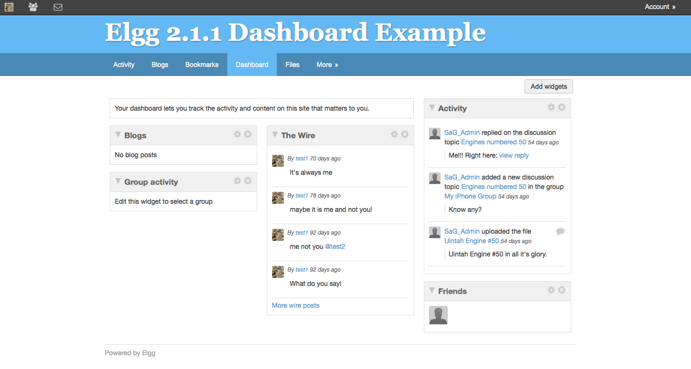

Dashboard
=========

   A typical Elgg dashboard

The dashboard is bundled with both the full and core-only Elgg packages. This is a users portal to activity that is important to them both from within the site and from external sources. Using Elgg's powerful widget API, it is possible to build widgets that pull out relevant content from within an Elgg powered site as well as grab information from third party sources such as Twitter or Flickr (providing those widgets exist).
A users dashboard is not the same as their profile, whereas the profile is for consumption by others, the dashboard is a space for users to use for their own needs.
