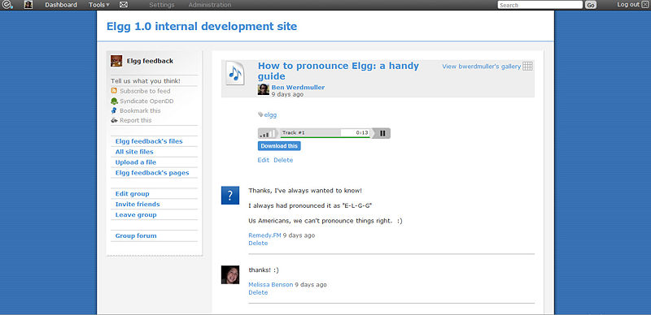

File repository
===============

   
   A file in an Elgg file repository

The file repository allows users to upload any kind of file. As with everything in an Elgg system, you can filter uploaded files by tag and restrict access so that they're only visible by the people you want them to be. Each file may also have comments attached to it.

There are a number of different uses for this functionality

Photo gallery
-------------

When a user uploads photographs or other pictures, they are automatically collated into an Elgg photo gallery that can be browsed through. Users can also see pictures that their friends have uploaded, or see pictures attached to a group. Clicking into an individual file shows a larger version of the photo.

Podcasting
----------

An Elgg file repository RSS feed automatically doubles as an RSS feed, so you can subscribe to new audio content using programs like iTunes.

Special content
---------------

It is possible for other plugins to add to the players available for different content types. It's possible for a plugin author to embed a viewer for Word documents, for example.

Note for developers
-------------------

To add a special content type player, create a plugin with views of the form ``file/specialcontent/mime/type``. For example, to create a special viewer for Word documents, you would create a view called ``file/specialcontent/application/msword``, because ``application/msword`` is the MIME-type for Word documents.
Within this view, the ``ElggEntity`` version of the file will be referenced as ``$vars['entity']``. Therefore, the URL of the downloadable file is:

.. code-block:: php
	
	echo $vars['entity']->getDownloadURL();

Using this, it should be possible to develop most types of embeddable viewers.
