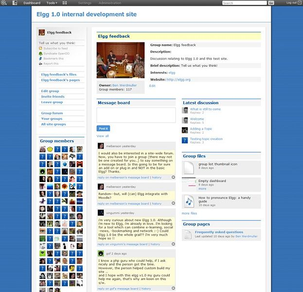

Groups
======

   
   A typical group profile

Once you have found others with similar interests - or perhaps you are part of a research groups or a course/class - you may want to have a more structured setting to share content and discuss ideas. This is where Elgg's powerful group building can be used.
You can create and moderate as many groups as you like

- You can keep all group activity private to the group or you can use the 'make public' option to disseminate work to the wider public.
- Each group produces granular RSS feeds, so it is easy to follow group developments
- Each group has its own URL and profile
- Each group comes with a :doc:`file`, forum, pages and messageboard