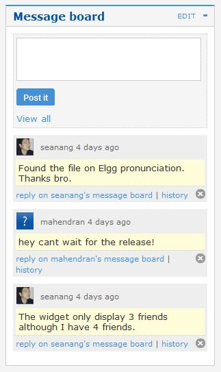

Messageboard
============

   
   A sample messageboard placed on the profile

The messageboard - similar to 'The Wall' in Facebook or a comment wall in other networks is a plugin that lets users put a messageboard widget on their profile. Other users can then post messages that will appear on the messageboard.
You can then reply directly to any message and view the history between yourself and the person posting the message.
