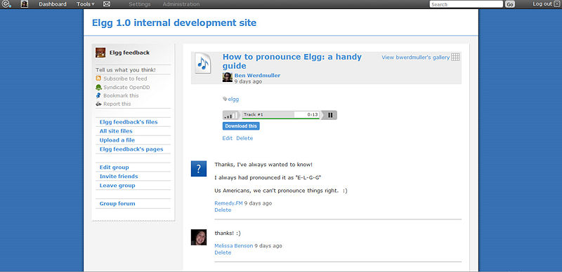

Pages
=====

   
   An Elgg Page

The pages plugin allows you to save and store hierarchically-organized pages of text, and restrict both reading and writing privileges to them. This means that you can collaboratively create a set of documents with a loose collection of people, participate in a writing process with a formal group, or simply use the functionality to write a document that only you can see, and only choose to share it once it's done.
The easy navigation menu allows you to see the whole document structure from any page. You can create as many of these structures as you like; each individual page has its own access controls, so you can reveal portions of the structure while keeping others hidden. In keeping with all other elements in Elgg, you can add comments on a page, or search for pages by tag.

Usage
-----

Pages really come into their own in two areas, firstly as a way for users to build up things such as a resume, reflective documentation and so on. The second thing is in the area of collaboration, especially when in the context of groups. With the powerful access controls on both read and write, this plugin is ideal for collaborative document creation.

.. note::

   Developers should note that there are actually 2 types of pages:
   
   1. Top-level pages (with subtype ``page_top``)
   2. Normal pages (with subtype ``page``)