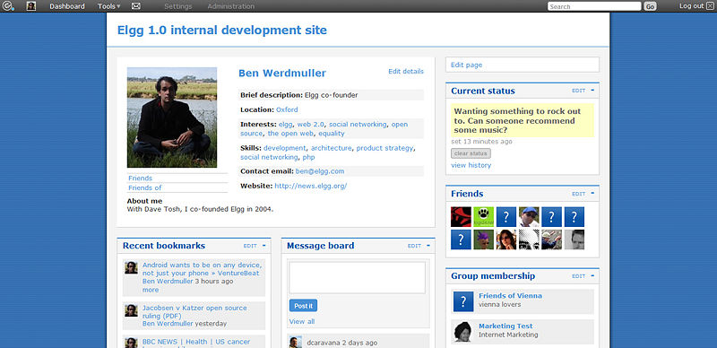
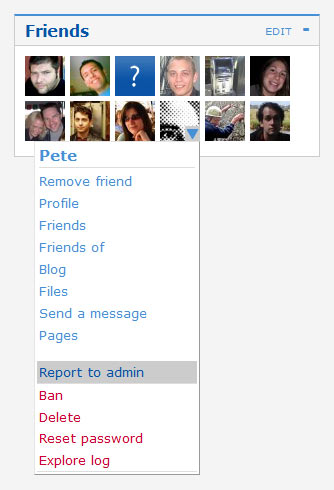

Profile
=======

   
   An Elgg profile

The profile plugin is bundled with both the full and core-only Elgg packages. The intention is that it can be disabled and replaced with another profile plugin if you wish.
It provides a number of pieces of functionality which many consider fundamental to the concept of a social networking site, and is unique within the plugins because the profile icon it defines is referenced as standard from all over the system.

User details
------------

This provides information about a user, which is configurable with the ``fields, user:user`` hook. You can change the available profile fields from the admin panel.
Each profile field has its own access restriction, so users can choose exactly who can see each individual element. Some of the fields contain tags (for example *skills*) limiting access to a field will also limit who can find you by that tag.

User avatar
-----------

   
   The Elgg context menu

The user avatar represents a user (or a group) throughout the site. By default, this includes a context-sensitive menu that allows you to perform actions on the user it belongs to wherever you see their avatar. For example, you can add them as a friend, send an internal message, and more. Each plugin can add to this context menu, so its full contents will vary depending on the functionality active in the current Elgg site.

Notes for developers
--------------------

Using a different profile icon
   To replace the profile icon, or provide more content, extend the ``icon/user/default`` view.

Adding to the context menu
   The context menu can be expanded by registering a :ref:`plugin hook <design/events#plugin-hooks>` for 'register' 'menu:user_hover', the following sections have special meaning:

   - **default** for non-active links (eg to read a blog)
   - **admin** for links accessible by administrators only

   In each case, the user in question will be passed as ``$params['entity']``.