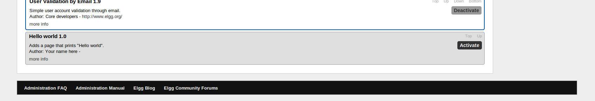
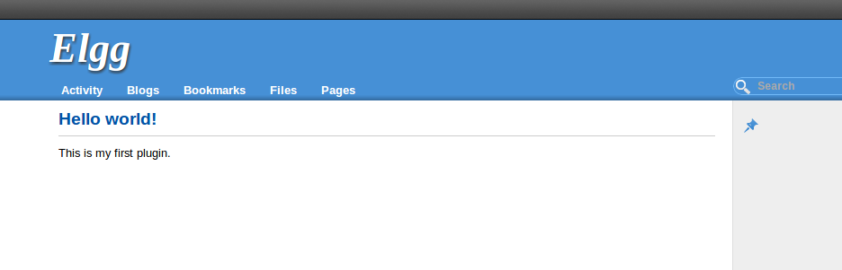

Hello world
###########

This tutorial shows you how to build a simple plugin that adds a new page and
prints the text "Hello world" on it.

In this tutorial we will use the address ``http://www.mysite.com/`` as an example.
While developing the plugin you should use the address of your own site
instead of the example address.

Required files
==============
First of all you need a directory that will hold all the files required by the
plugin. Go to the ``mod`` directory of your Elgg site and create there a
directory with the name ``hello_world``.

Go to the ``hello_world`` directory and create these two files inside it:
 - start.php
 - manifest.xml

Copy this to the ``manifest.xml`` file:

.. code-block:: xml

    <?xml version="1.0" encoding="UTF-8"?>
    <plugin_manifest xmlns="http://www.elgg.org/plugin_manifest/1.8">
        <name>Hello world</name>
        <id>hello_world</id>
        <author>Your name here</author>
        <version>1.0</version>
        <description>Adds a page that prints "Hello world".</description>

        <requires>
            <type>elgg_release</type>
            <version>1.9</version>
        </requires>
    </plugin_manifest>

Add your name to the ``<author></author>`` element.

The plugin has now the minimum requirements for your site to recognize it.
Log in to your site as an administrator and access the plugins page at the
administration panel. By default the plugin is at the bottom of the plugins
list. Click the "Activate" button to start it.

   The Hello world plugin has appeared to the bottom of the plugin list

Initializing the plugin
=======================

The next step is to add some actual features. Open the ``start.php`` and copy
this to it:

.. code-block:: php

    <?php

    elgg_register_event_handler('init', 'system', 'hello_world_init');
    
    function hello_world_init() {
    
    }

This piece of code tells Elgg that it should call the function
``hello_world_init()`` when the Elgg core system is initiated.

Registering a page handler
==========================

The next step is to register a page handler which has the purpose of handling
request that users make to the URL http://www.mysite.com/hello/.

Update the ``start.php`` to look like this:

.. code-block:: php

    <?php

    elgg_register_event_handler('init', 'system', 'hello_world_init');
    
    function hello_world_init() {
        elgg_register_page_handler('hello', 'hello_world_page_handler');
    }
    
    function hello_world_page_handler() {
    	$params = array(
            'title' => 'Hello world!',
            'content' => 'This is my first plugin.',
    	    'filter' => '',
        );

        $body = elgg_view_layout('content', $params);

        echo elgg_view_page('Hello', $body);
    }

The call to ``elgg_register_page_handler()`` tells Elgg that it should
call the function ``hello_world_page_handler()`` when user goes to your site
and has "hello" at the end of the URL.

The ``hello_world_page_handler()`` makes it possible for the users to access
the actual page. Inside the function we first give an array of parameters to the
``elgg_view_layout()`` function.

The parameters include:
 - The title of the page
 - The contents of the page
 - Filter which is left empty because there's currently nothing to filter
 
This creates the basic layout for the page. The layout is then run through
``elgg_view_page()`` which assembles and outputs the full page.

You can now go to the address http://www.mysite.com/hello/ and you should see the page.

   Elgg is now routing the URL http://www.mysite.com/hello/ to the page you created. 
